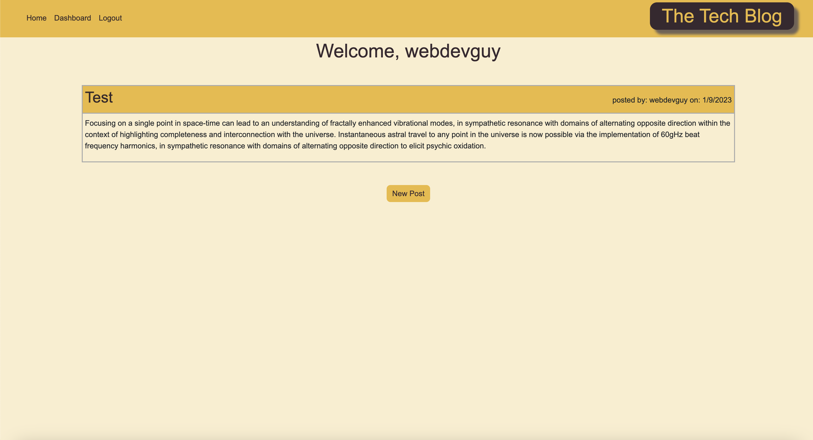

# tech-blog

## Description 

This full-stack application allows developers to publish tech-related blog posts and comment of the posts of other developers. Upon visiting the site, the user can see a list of blog posts that have previously been posted. In order to interact with the application, the user will need to either sign-up or log in. Once you have signed-up or logged in, you can then create, update, or delete your own posts, and comment on the posts of other developers. The app follows the MC paradigm and uses the following:

Handlebars.JS
MySQL2
Sequelize
express-session
b-crypt

## Table of Contents

  - [Installation](#installation)
  - [Usage](#usage)
  - [License](#license)
  - [Credit](#credit)
  - [Questions](#questions)
  - [Tests](#tests)

## Installation

No installation required for this app.

## Usage

This app is deployed on Heroku:

https://git.heroku.com/sheltered-brushlands-54086.git 

## License

This application uses the MIT license.
  
MIT: https://choosealicense.com/licenses/mit/

## Credit

Thank you to my Penn boot camp instructor Leif Hetland for assisting debugging and to my tutor Omar Carmona for helping me get a better grasp on this project.

## Questions

If you have any questions about the repo, open an issue or 
contact me directly at ryanmbelcher86@gmail.com. You can find more of my work at 
https://github.com/ryanmbelcher.